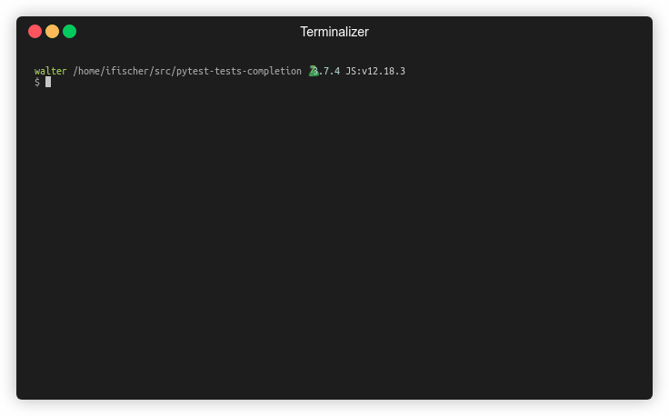

# Pytest tests completion

This repository demonstrates how to provide shell completion (currently Bash only)
for all pytest test cases (classmethods and functions) within the current project.

This makes it more convenient to run specific tests from Terminal without having to 
look up the test name in an editor before, especially if you have a large number of tests.

## Demo

 
 
## Usage

Add content from `./conftest.py` to your projects `conftest.py`.

Run pytest within your project directory:
```shell
pytest --collect-tests
```
This will create a file `.pytest.completion` containing the names 
of all your tests.

Source the Bash completion script:
```
source bash_completion/pytest.completion
```
Enjoy autocompletion for your test cases:

```bash
pytest [TAB]
pytest test_sample_1.py[TAB]
```

For long-term usage, copy pytest.completion to your distributions 
bash_completion directory so it is sourced automatically.
